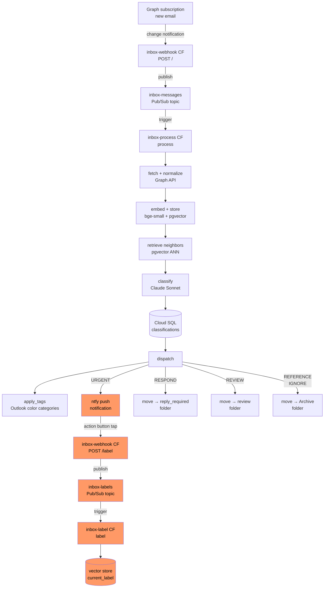

# Inbox

Unified message triage system. Classifies incoming email (with SMS and voicemail coming later) into five action-oriented categories using an LLM, with a retrieval-augmented feedback loop that improves over time as you confirm and correct classifications.

See [docs/inbox-architecture.md](docs/inbox-architecture.md) for the full design and migration plan.

## How it works

New emails trigger a Microsoft Graph change notification → Cloud Function (webhook) → Pub/Sub → Cloud Function (processor). The processor normalizes the message, embeds it with bge-small, retrieves similar past messages with human-confirmed labels, builds a retrieval-augmented prompt, and calls Claude Sonnet to classify it. The result drives a folder move in Outlook, tags the email with Outlook color categories, and (for urgent messages) fires a push notification via self-hosted ntfy with action buttons. Tapping a button corrects the label and feeds it back into the vector store.

**Categories**: `urgent` · `respond` · `review` · `reference` · `ignore`  
**Importance**: `P0` (critical) · `P1` · `P2` · `P3` (nice to have) — independent of category

## Current state

Phases 1–4 complete and live. Ready for Phase 5 (bootstrap labels, decommission Cloud Run Job fallback).

## Project structure

```
clients/          # External service connections (Graph API, DB, Claude, bge model, ntfy)
models/           # Shared type definitions (Message, Category, Classification)
repo/             # Database read/write (messages, classifications, embeddings, senders, tags)
services/         # Business logic (ingestion, embedding, classification, labeling, archiving)
handlers/         # Multi-service orchestration (pipeline, per-category actions)
functions/        # Cloud Function entry points (webhook, renew)
scripts/          # Entry points and one-off jobs
main.py           # Processor Cloud Function entry point (Pub/Sub triggered)
terraform/        # GCP infrastructure (Cloud Functions, Pub/Sub, Cloud SQL, Scheduler, Secrets)
docs/             # Architecture and design docs
```

## Local development

### Prerequisites

- Python 3.11+
- An Azure app registration with `Mail.Read` and `Mail.ReadWrite` permissions on a Microsoft 365 mailbox
- A `.env` file with the required variables (see below)

### Setup

```bash
python -m venv .venv
source .venv/bin/activate
pip install -r requirements.txt
```

### Environment variables

```bash
# Azure / Microsoft Graph
CLIENT_ID=
CLIENT_SECRET=
TENANT_ID=

# LLM
OPENAI_API_KEY=      # current (Cloud Run Job fallback)
ANTHROPIC_API_KEY=   # target (Phase 3+)

# Database — local dev uses direct psycopg; production uses Cloud SQL Python Connector
# For local dev: set POSTGRES_* and leave CLOUD_SQL_CONNECTION_NAME unset
POSTGRES_HOST=localhost
POSTGRES_PORT=5432
POSTGRES_USER=
POSTGRES_PASSWORD=
POSTGRES_DB=app

# For production / testing against Cloud SQL directly:
# CLOUD_SQL_CONNECTION_NAME=bens-project-462804:us-central1:inbox

# Leave unset for local interactive mode; set to your GCP project ID for headless mode
# GCP_PROJECT_ID=
```

### Authenticate (first time)

The first run requires an interactive device code login to get an MSAL token:

```bash
python scripts/seed_token_cache.py > /tmp/msal_cache.json
# Follow the device code prompt in your browser
```

The token is cached at `~/.inbox-token-cache.json` for local development. Seed it into Secret Manager for production:

```bash
gcloud secrets versions add msal-token-cache --data-file=/tmp/msal_cache.json
rm /tmp/msal_cache.json
```

### Run locally

```bash
python scripts/analyze_emails.py
```

Runs in interactive mode: fetches the latest 10 emails, unread emails, and emails from the last 24 hours. Prints classifications to stdout. Does not move any emails unless `EMAIL_ANALYSIS_MOVE_TO_ACTION_FOLDERS=true` is set.

## Deployment

Infrastructure is managed with Terraform. Terraform state is stored remotely in GCS (`bens-project-462804-tf-state`). Secrets are stored in GCP Secret Manager and injected at runtime.

### Automatic deploys (CI/CD)

Pushing to `main` triggers `.github/workflows/deploy.yml`, which runs `terraform apply` automatically. This covers any change to `main.py`, `clients/`, `models/`, `repo/`, `services/`, `handlers/`, `functions/`, `requirements.txt`, or `terraform/`. Changes to `docs/`, `scripts/`, or `.claude/` do not trigger a deploy.

Typical deploy time: ~8–12 minutes (dominated by GCP Cloud Function build time).

### Manual apply (local)

Run locally when you need to apply before pushing, or for changes the CI path doesn't cover:

```bash
cd terraform
terraform init   # connects to remote GCS state automatically
terraform apply
```

### First-time setup (new machine)

```bash
cd terraform
cp terraform.tfvars.example terraform.tfvars
# Fill in terraform.tfvars with real values
terraform init   # pulls state from GCS
terraform apply
```

After the very first apply (which creates Cloud SQL), run the schema migration:

```bash
CLOUD_SQL_CONNECTION_NAME=bens-project-462804:us-central1:inbox \
  POSTGRES_USER=inbox POSTGRES_PASSWORD=<password> POSTGRES_DB=app \
  python scripts/migrate_db.py
```

## Architecture

See [docs/inbox-architecture.md](docs/inbox-architecture.md).


